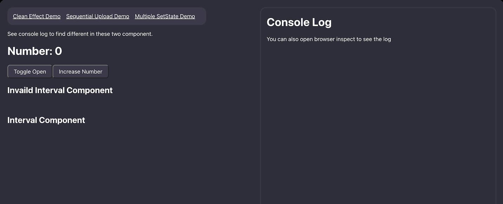

# React Various State Mistakes

This is about several common mistakes about React state.

- [Clean Effect](#clean-effect)
- [Sequential Upload](#sequential-upload)
- [Multiple Set State](#multiple-set-state)

## Clean Effect

`React.useEffect` will execute every time when the state in dependency was changed.
In the previous execution of `React.useEffect`, the states it used aren’t the same as the new states after an update.
So in `React.useEffect`, it should return a function (clean effect), that does something to unsubscribe (like `eventListener`) or cancel (like `setTimeInterval`) to prevent using the old state and executing the callback function multiple times.
The clean effect function will be invoked before executing the next `React.useEffect`.

## Sequential Upload

In React component, if a state isn’t a primitive type, the state’s reference will be different from the previous update.

## Multiple Set State

If there are multiple `setState`s executed in an update and only give a value to `setState`, the final state will be the last one.
Give `setState` a callback function that can get the updated state by the previous `setState`.
And then, use the updated state in a callback function to do some calculations and return a new state.